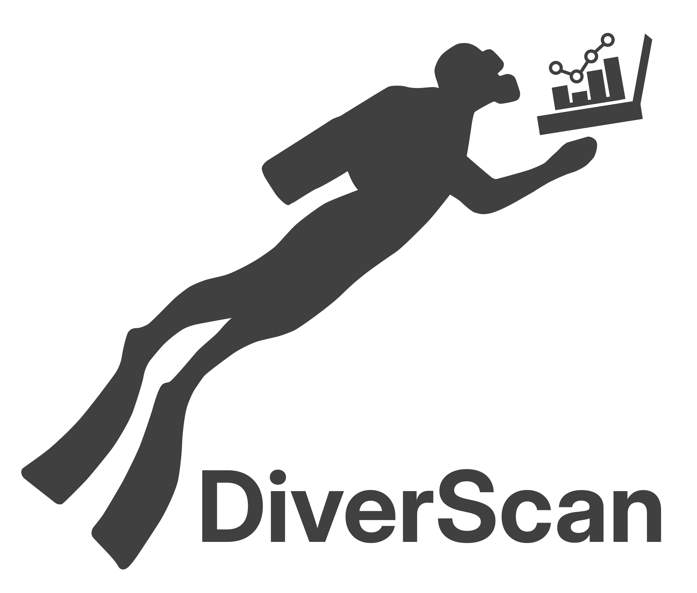

<p align="center">
  
</p>

# DiverScan

DiverScan finds out *what* differs in the movement of animals recorded under
different conditions. You give it trajectories from two or more conditions
(for example, males vs. females, or before vs. after a treatment). It trains a
model to tell the conditions apart, and then shows you which parts of the
trajectories the model paid attention to, and which movement features those
parts are associated with.

Everything runs in Google Colab, in your browser. No installation is needed,
and no programming: each notebook is a form you fill in and run.

> **Before you run anything: have a Google account ready, and put
> `DiverScan-release` directly under "My Drive".**
>
> You need a Google account (for Google Drive and Google Colab); sign in to it
> first. Then download the ready-to-use `DiverScan-release` folder from
> <https://drive.google.com/drive/folders/1aW7cOEd50ctArG0MOgv-AJdWZFU-eDy5?usp=sharing>,
> unzip it, and upload the unzipped folder to the top level of your Google
> Drive, so that it is `My Drive/DiverScan-release`. Then open the notebooks
> inside it in Colab; no further setup is needed. The notebooks read
> everything from `/content/drive/MyDrive/DiverScan-release` and will not
> find their files anywhere else.
>
> The folder is a complete copy of DiverScan. It also contains an example
> dataset, the courtship behavior of fruit flies, to try the notebooks on, and
> the two finished demo projects (`worm_demo` and `sinewave_demo`) that the
> demo notebooks show. The demo projects are only on Google Drive, not in this
> repository.

## What you need

- A Google account, for Google Drive and Google Colab.
- Trajectory data as CSV files: either the output of a pose-tracking tool such
  as DeepLabCut, or your own table of `time`, `x`, `y` (and any other columns
  you like) per recording. Notebook 01 explains both layouts in detail.
- At least two conditions to compare, each with many recordings, one CSV
  file per recording. Aim for 100 or more files per condition, and 150 or
  more if you can: the model learns from the differences between recordings,
  so it needs enough of them to find patterns that hold across the condition.
  Similar numbers of files in each condition work best.

## Setting up your Google Drive

Copy this repository into your Google Drive as a folder called
`DiverScan-release`.
Inside it, make a `data` folder and put one folder per condition in it. The
folder names become the condition names.

```
My Drive/
└── DiverScan-release/
    ├── notebooks/        the notebooks (from this repository)
    ├── utils/            the code behind them (from this repository)
    ├── data/             your recordings
    │   └── my_experiment/
    │       ├── condition_A/
    │       │   ├── skeleton_data_folder/   pose-tracking CSVs
    │       │   └── userset_data_folder/    your own CSVs
    │       └── condition_B/
    │           └── ...
    └── projects/         created by the notebooks; one folder per analysis
```

Notebook 01 asks for `DiverScan_folder`, the path of that folder, which in
Colab is normally `/content/drive/MyDrive/DiverScan-release`, and for `project_name`;
it finds `utils` and `data` from there and creates your project under
`projects`. Notebooks 02 to 05 ask only for `project_folder`, the path of
that project, and find everything else from there.

## Running an analysis

Open the notebooks from Google Drive with Google Colab (right-click a
notebook, "Open with", "Google Colaboratory") and run them in order.

> **If Google Drive says "No preview available" when you open a notebook**,
> Colab is not yet connected to your Google Drive. At the top of that preview,
> open the "Open with" menu and choose "Connect more apps". In the Google
> Workspace Marketplace that opens, search for "Colaboratory" and click
> "Install". After that, "Google Colaboratory" appears under "Open with".

In each
one, fill in the form at the top, then choose "Run all" from the Runtime menu.
Notebooks 02 to 04 train a model and need a GPU: in Colab, choose Runtime,
"Change runtime type", and pick a GPU before running them.
Notebook 05b is optional, runs after 05, and talks to Google's Gemini API, so
it needs an API key; the notebook explains where to put it.

| Step | Notebook | What it does | Needs a GPU |
|---|---|---|---|
| 1 | `01_build_dataset` | Reads your CSVs, computes movement features (speed, turning angle, distance to a point you choose, and so on), splits the recordings into training, validation and test sets, and saves the dataset. | No |
| 2 | `02_search_architecture` | Tries many model shapes and keeps the one that separates your conditions best. This is the slowest step; you can stop it and resume later. | Yes |
| 3 | `03_train_model` | Trains the chosen model on the training set and keeps the epoch that does best on the validation set. | Yes |
| 4 | `04_test_model` | Measures the model on the test set, which it has never seen, and computes everything the last notebook shows: attention maps, feature correlations and histograms. | Yes |
| 5 | `05_visualize_results` | Shows the results: how well the conditions were told apart, where on the trajectories the model looked, and which features go with those places. | No |
| 5b | `05b_interpret_with_llm` | Optional, after step 5. Sends the summary table written by step 5 to a Gemini model, asks it to interpret the attention branches, and lets you ask follow-up questions. Needs a Gemini API key, stored in Colab as a secret named `GOOGLE_API_KEY`. | No |

Step 1 creates a folder for your analysis under `projects`, named after
`project_name`. Steps 2 to 5 ask for the path of that folder as
`project_folder` and write their results into it:

```
projects/my_experiment/
├── dataset/                  from step 1
│   └── 01_build_dataset_20260924120000/
├── utils_20260924120000/     a copy of the code, taken when the project was made
├── optuna/                   from step 2
│   └── 02_search_architecture_20260924130000/
└── training/                 from step 3, with the results of step 4 inside
    ├── 03_train_model_20260924140000/
    └── 04_test_model_20260924150000/
```

The copy of the code is what steps 2 to 5 run. It stays with the project, so
you can come back to an old analysis, or share the folder with someone, and
get the same results even after the code in `DiverScan-release/utils` has changed.
Steps 1 to 4 also each leave a folder named after the notebook and the time it
was run, holding a copy of the notebook with the values you filled in, a
`run_record.txt` listing the software versions, and a `requirements.txt`
listing the installed packages.

## A few things worth knowing

- **Which recordings go where is decided by the `seed` in notebook 01.** The
  same seed always gives the same training, validation and test split, and
  `dataset/dataset_split.txt` lists which recordings went into each set.
- **Each condition needs enough recordings to fill all three sets.** With the
  default split of 60 / 20 / 20 percent, that means five or more per
  condition; the notebook stops with a message if a set would be empty.
- **Attention is easier to read with more than one branch.** The model has
  several attention branches, each encouraged to look at a different part of
  the trajectories. `number_of_attention_branches` in notebook 02 sets how
  many.
- **Recordings may have different lengths.** Shorter ones are padded, and the
  models ignore the padding.

## The worm demo

`worm_demo_attention_visualization.ipynb`, in the top folder, walks through
the results of a finished analysis: trajectories of the nematode
*C. elegans* under two conditions, `preexp` and `naive`, and a model with
five attention branches trained to tell them apart. It shows the same result
cells as notebook 05, so you can see what DiverScan produces before running
it on your own data. Its last cell, "LLM summary", turns the correlation and
distribution tables into a written interpretation of each attention branch:
with an Anthropic API key it asks Claude, and without one it shows a report
prepared ahead of time, so no key is needed to see the demo.

## The sine-wave demo

`sinewave_demo_attention_visualization.ipynb`, also in the top folder, shows
what the attention branches learn on a synthetic dataset: sine waves that
switch between 6 and 9 Hz, with (MixedFreq) or without (SingleFreq) short
1 Hz and 14 Hz segments. For each of the five training seeds, the two
branches of the trained model settle on the 1 Hz and the 14 Hz segments
respectively.

Both demo notebooks run on their own and do not touch your Google Drive: they
download the demo project they need (`worm_demo` or `sinewave_demo`, from the
`DiverScan-release.zip` in the Google Drive folder linked at the top of this
page) into the Colab session's temporary disk, and leave nothing behind when
the session ends. Open one in Colab, choose "Run all", and that is it.

## Adding your own channels

Any other column in your own CSV becomes a feature when you list its name in
`names_of_userdefined_features` in notebook 01. Accelerometer channels, for
example, go next to the coordinates:

```
time,x,y,acc_x,acc_y,acc_z
0.0,12.4,8.1,0.02,-0.98,0.11
0.1,12.5,8.0,0.03,-0.97,0.10
...
```

With `names_of_userdefined_features = ['acc_x', 'acc_y', 'acc_z']`, the three
channels are used alongside the movement features computed from `x` and `y`,
and they appear in the results of notebook 05 like any other feature. The
guide at the end of notebook 01 shows the same layout for several animals.

## Running outside Colab

The notebooks also run in Jupyter. The Colab forms then appear as plain code
at the top of each notebook; edit the values there. Install the requirements
first:

```
pip install -r requirements.txt
```

Install PyTorch beforehand, following the instructions for your GPU at
<https://pytorch.org/get-started/locally/>.

## Citing DiverScan

If DiverScan contributes to your work, please cite the paper describing it.
The reference will be added here on publication.

## License and patent

DiverScan is released under the [PolyForm Noncommercial License 1.0.0](LICENSE).
You may use, modify and share it for noncommercial purposes, such as research
and teaching; commercial use requires a separate license from the authors.

The method implemented here is the subject of a pending international patent
application, PCT/JP2025/033243.
